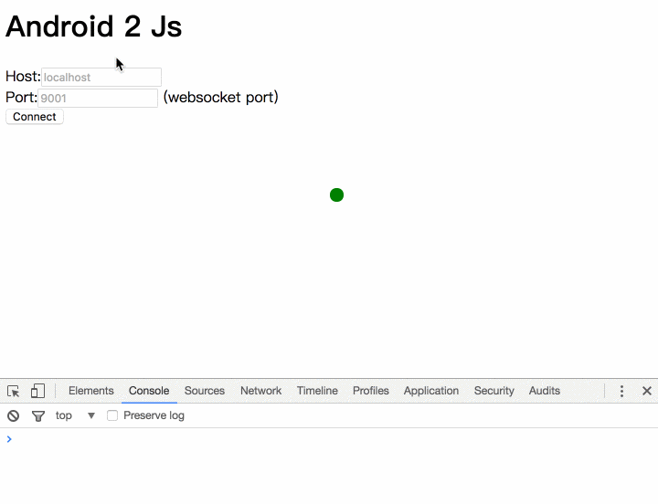

# mqtt websocket communication Demo

- Broker: mosquitto (https://mosquitto.org/)
- Android client: Paho (http://www.eclipse.org/paho/clients/android/)
- Javascript client: Paho (http://www.eclipse.org/paho/clients/js/)


#install broker 
#### with Docker
```
$ docker run -d -p 1883:1883 -p 9001:9001 --name=mosquitto sourceperl/mosquitto
```
#### OR mosquitto + config
download https://mosquitto.org/download/

find your websocket.conf, and set websocket listen port.
```
listener 1883

listener 9001
protocol websockets
```
restart service

# open demo.html


# install apk on your Android device
[apk/mqtt.apk](apk/mqtt.apk)


Reference https://www.latech.tw/2017/02/mqtt.html